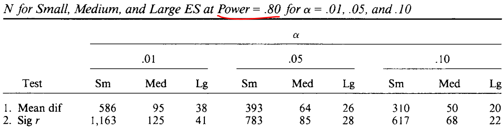
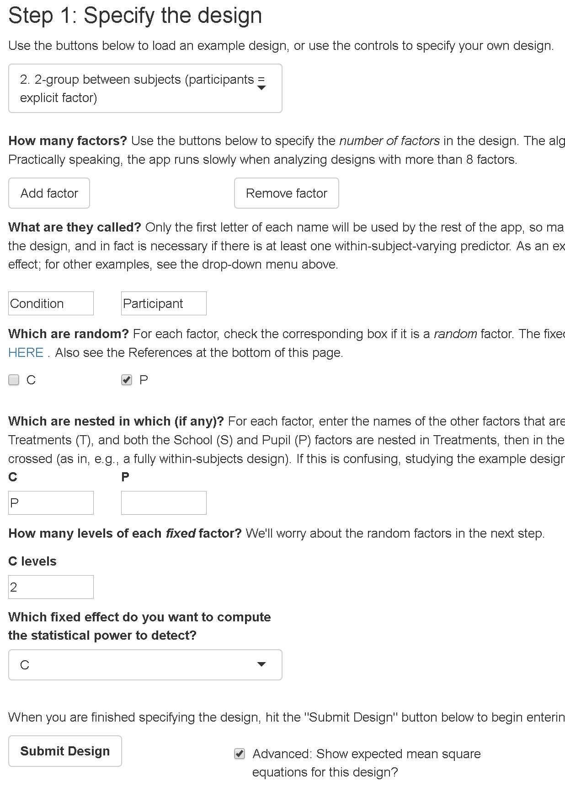
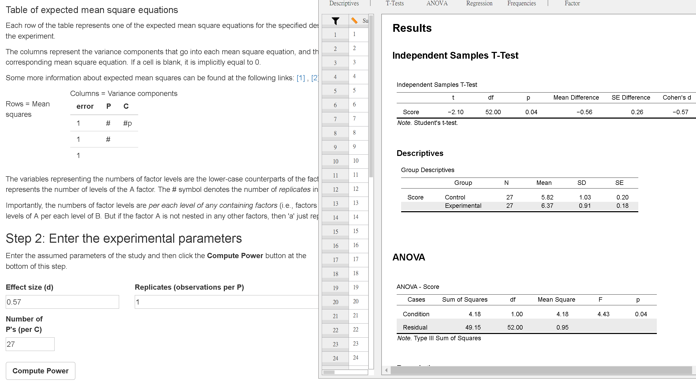
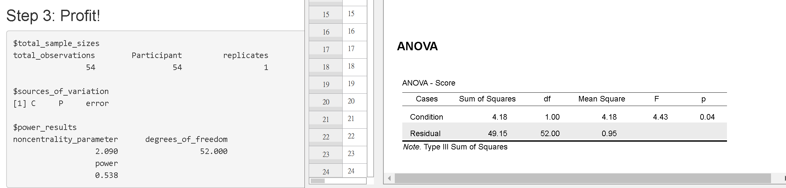
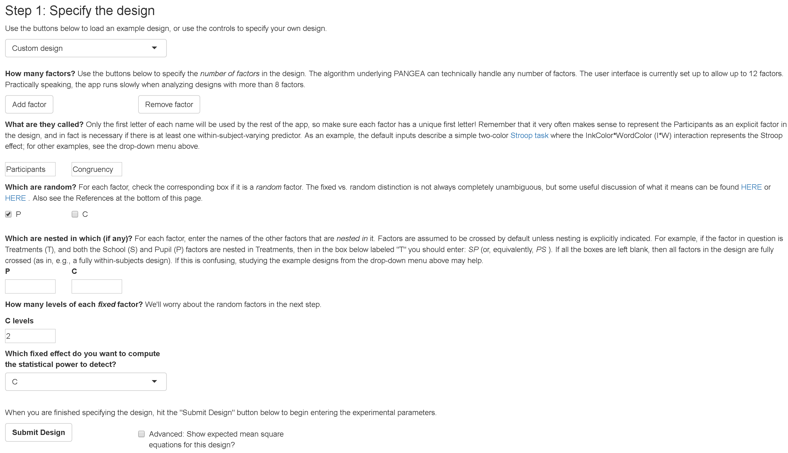
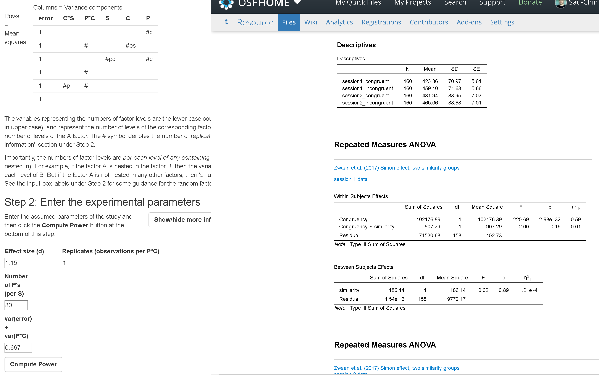
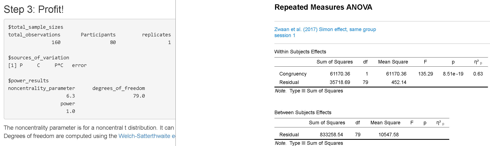
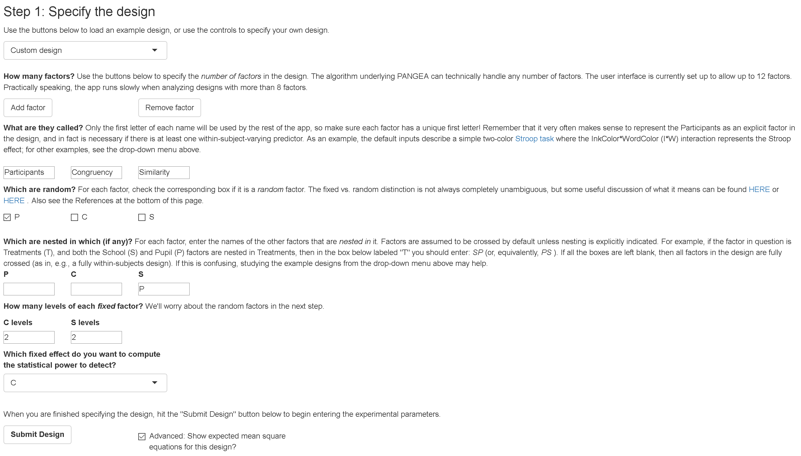
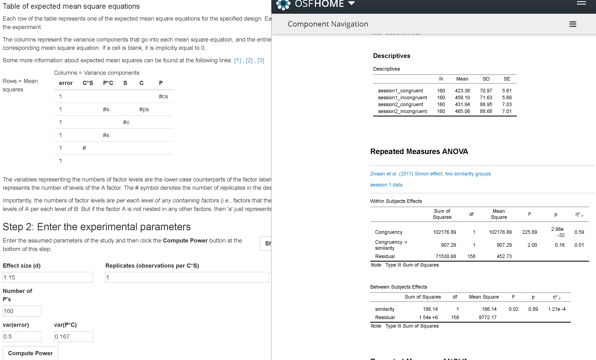
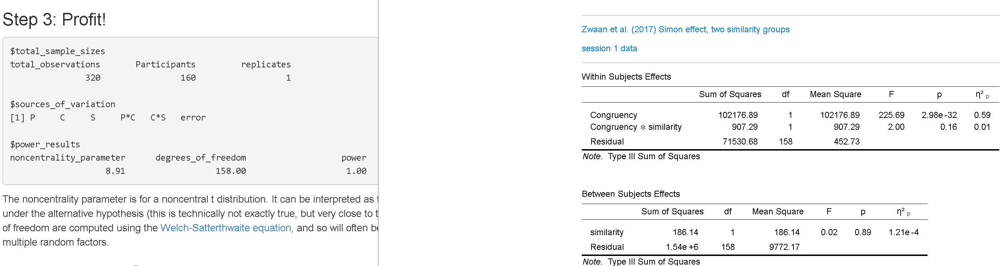

# 實驗效果量資訊

## 

- 開始以隨機程序收集資料的實驗之前，根據假設推論最有可能測得的效果量估計值。

## 效果量的分類

|種類|計算基礎|成員|
|---|---|---|
|差異|平均數|$\theta$, Cohen's d, Hedges' g|
|相關|變異數|r, $r^2$, $\eta^2$, $\omega^2$,Cohen's $f^2$,Cohen's q|
|類別|次數比例|$\phi$, 賠率比, Cohen's w, Cohens' h|

## 效果量建議強度

節錄自 @cohenPowerPrimer1992 表1

|實驗結果|效果量指標|小 ~ 中 ~ 大|
|---|---|---|
|獨立樣本平均數差異|Cohen's d| .20 ~ .50 ~ .80 |
|連續變項之相關|r|.10 ~ .30 ~ .50|
|適合度考驗的卡方檢定|w|.10 ~ .30 ~ .50 |

## 效果量與建議樣本數

節錄自 @cohenPowerPrimer1992 表2

```{r Cohen_Table2, echo=FALSE, message=FALSE, warning=FALSE, paged.print=TRUE}

```

## 為何Cohen要公開建議

- 事前估計考驗力需要收集充分資訊。
- 1992年的個人電腦軟體無足夠資源以效果量與樣本數估計考驗力。

# 考驗力分析的運用方向

##

1. 實驗效果敏感度分析(sensitivity analysis)：預期實驗結果在一段效果量範圍之內，估計達到設定考驗力的樣本數範圍。

2. 實驗效果事前資訊分析(prior power analysis)：預期實驗結果等於已知效果量，估計達到設定考驗力的樣本數。

3. 事後考驗力評估(post-hoc power analysis)：完成實驗後，分析達到的考驗力。

## 估計樣本數的需要資訊

- 以設定達到的考驗力為評估指標
- 實驗設計：獨變項性質、數目
- 可能測得的效果量(敏感度分析)；預期可得的效果量(事前資訊分析)

## PANGEA：變異數分析通用設計考驗力分析套件

作者：[Jack Westfall](http://jakewestfall.org/) -@westfall_pangea:_2016

- [線上版](https://jakewestfall.shinyapps.io/pangea/)
- [程式碼](https://github.com/jake-westfall/pangea)


# 獨立樣本設計

##

- 範例：[Results of Mayes' studies](https://osf.io/s8g4j/)

- 敏感度分析: 如果統計顯著的效果量是0.4~0.55，要多少人才能達到80%考驗力？
- 事前資訊分析: 如果統計顯著的效果量是0.55，要多少人才能達到80%考驗力？

## 第一步：設計宣告 {#I-1}

滑鼠右鍵選單開啟檢視圖片

```{r mayes_step01, echo=FALSE, message=FALSE, warning=FALSE, paged.print=TRUE,out.height="50%"}

```

## 第二步：輸入效果量與樣本數 {#I-2}

```{r mayes_step02, echo=FALSE, message=FALSE, warning=FALSE, paged.print=TRUE,out.height="50%"}

```

<!---
## 分解變異數 {#I-3}

|變異數來源|實驗效應是固定效果|實驗效應是隨機效果|
|:---:|:---:|:---:|
|C|$$\sigma_{\varepsilon}^2 + \frac{n \alpha^2}{p-1}$$|$$\sigma_{\varepsilon}^2 + n \sigma_{\alpha}^2$$|
|P|$$\sigma_{\varepsilon}^2$$|$$\sigma_{\varepsilon}^2$$|
--->

## 第三步：檢視考驗力 {#I-4}

```{r mayes_step03, echo=FALSE, message=FALSE, warning=FALSE, paged.print=TRUE,out.height="50%"}

```

## 整理達到的考驗力

|分組人數|d = 0.40|d=0.45|d=0.50|d=0.55|
|---|:---:|:---:|:---:|:---:|
|30|||||
|40|||||
|50|||||
|60|||||
|70|||||
|80|||||
|90|||||
|100|||||

# 相依樣本設計

##

範例：@zwaanParticipantNonnaiveteReproducibility2017 [Simon effect, same group](https://osf.io/96k8s/)

- 敏感度分析: 如果統計顯著的效果量是1.15~1.30，要多少人才能達到80%考驗力？
- 事前資訊分析: 如果統計顯著的效果量是1.15，要多少人才能達到80%考驗力？

## 第一步：設計宣告 {#S-1}

```{r same_step01, echo=FALSE, message=FALSE, warning=FALSE, paged.print=TRUE,out.height="50%"}

```

## 第二步：輸入效果量與樣本數 {#S-2}

```{r same_step02, echo=FALSE, message=FALSE, warning=FALSE, paged.print=TRUE,out.height="50%"}

```

<!---
## 分解變異數 {#S-3}

- 參與者間的變異是隨機效果
- PAGEA採用非加成模式；一般變異數分析採加成模式
|變異數來源|實驗效應是固定效果|實驗效應是隨機效果|
|:---:|:---:|:---:|
|C|$$\sigma_{\varepsilon}^2 + \frac{n \alpha^2}{p-1}$$|$$\sigma_{\varepsilon}^2 + n \sigma_{\alpha}^2$$|
|P|$$\sigma_{\varepsilon}^2 + p\sigma_\pi^2$$|$$\sigma_{\varepsilon}^2 + p\sigma_\pi^2$$|
|Residual|$$\sigma_{\varepsilon}^2$$|$$\sigma_{\varepsilon}^2$$|
--->

## 第三步：檢視考驗力 {#S-4}

```{r same_step03, echo=FALSE, message=FALSE, warning=FALSE, paged.print=TRUE,out.height="50%"}

```

## 整理達到的考驗力 {#S-5}

|參與人數|d = 1.15|d=1.20|d=1.25|d=1.30|
|---|:---:|:---:|:---:|:---:|
|5|||||
|10|||||
|15|||||
|20|||||
|25|||||
|30|||||


# 混合設計

##

範例：@zwaanParticipantNonnaiveteReproducibility2017 [Simon effect, similarity groups](https://osf.io/t4zkx/)

- 敏感度分析: 如果統計顯著的效果量是1.15~1.30，要多少人才能達到80%考驗力？
- 事前資訊分析: 如果統計顯著的效果量是1.15，要多少人才能達到80%考驗力？


## 第一步：設計宣告 {#M-1}

```{r mixed_step01, echo=FALSE, message=FALSE, warning=FALSE, paged.print=TRUE,out.height="50%"}

```

## 第二步：輸入效果量與樣本數 {#M-2}

```{r mixed_step02, echo=FALSE, message=FALSE, warning=FALSE, paged.print=TRUE,out.height="50%"}

```

<!---
## 分解變異數 {#M-3}

TBA
--->

## 第三步：檢視考驗力 {#M-4}

```{r mixed_step03, echo=FALSE, message=FALSE, warning=FALSE, paged.print=TRUE,out.height="50%"}

```

## 整理達到的考驗力 {#M-5}

|參與人數|d = 1.15|d=1.20|d=1.25|d=1.30|
|---|:---:|:---:|:---:|:---:|
|5|||||
|10|||||
|15|||||
|20|||||
|25|||||
|30|||||


# 選擇實驗題目

## 

- 從 @zwaanParticipantNonnaiveteReproducibility2017 挑選想重現的實驗
- 分組計畫評估報告
    - 運用psytoolkit設計的可行性
    - 估計樣本數：敏感度分析或事前資訊分析
- 3/x 同組成員創建共享OSF Project，並分享老師Read+Write權限。
- 3/28 上課前上傳計畫評估報告；圓桌討論。


## 參考文獻