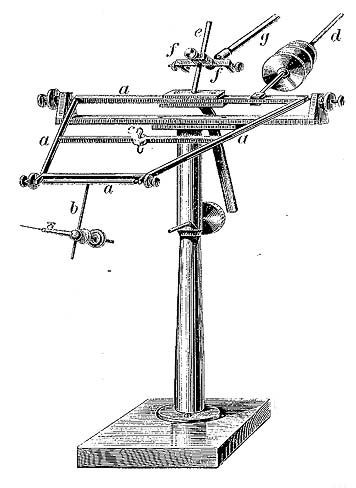
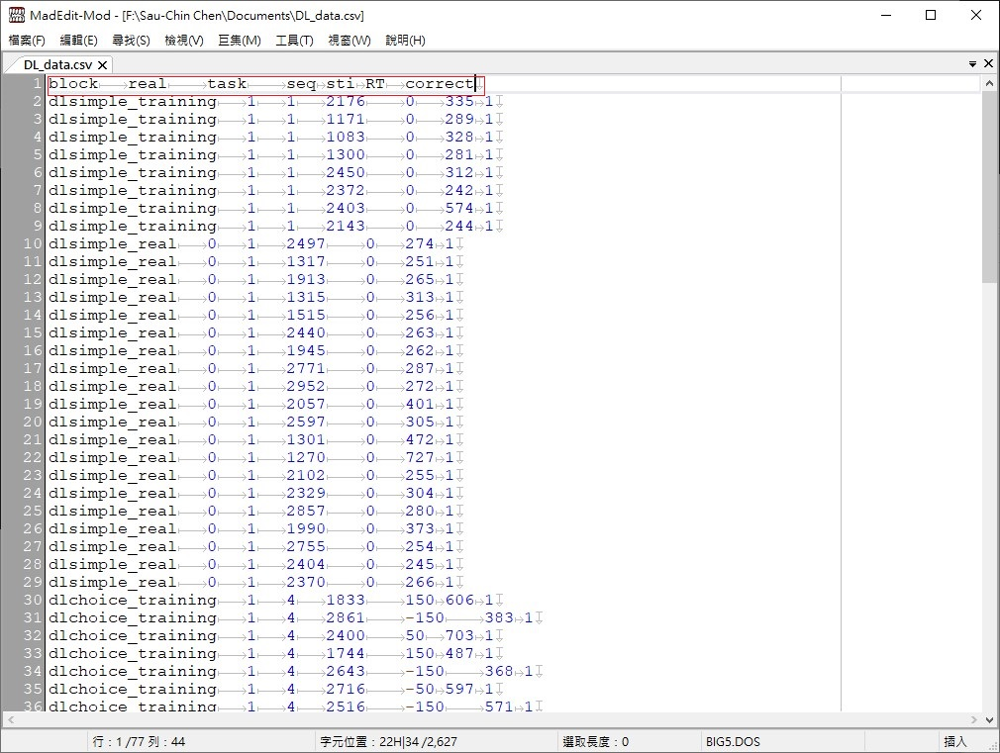

```{r setup, include=FALSE}
knitr::opts_chunk$set(echo = FALSE, 
                      warning = FALSE, 
                      message = FALSE)
```

## 單元說明

- 概述[心理計時學研究](https://scgeeker.github.io/EXPPSY_Opensci/chronometry.html)
- 體驗與探討經典知覺實驗
- 製作虛擬資料了解速度與正確率互補
- 運用psytoolkit重製實驗

## 心理計時學的起源 {.flexbox}

- [想法如何產生動作?](https://today.line.me/tw/pc/article/%E3%80%90%E5%A4%A7%E8%85%A6S01E01%E3%80%91%E5%92%8C%E7%AC%9B%E5%8D%A1%E5%85%92%E4%B8%80%E8%B5%B7%E6%80%9D%E8%80%83%E3%80%8C%E8%88%89%E6%89%8B%E3%80%8D%E6%80%8E%E9%BA%BC%E5%95%9F%E5%8B%95%E2%94%80%E2%94%80%E8%85%A6%E7%A7%91%E5%AD%B8%E7%9A%84%E6%AD%B7%E5%8F%B2%E7%B7%A3%E8%B5%B7%EF%BC%88%E4%B8%80%EF%BC%89-YPL7OL) by 謝伯讓
- 人類行為的個別差異
- 人類行為的測量誤差

## 人類行為的個別差異 {.small}

<div class="columns-2">
```{r Galton, out.width="60%", fig.cap="法蘭西斯·高爾頓(1822-1911)", paged.print=TRUE}
knitr::include_graphics("https://upload.wikimedia.org/wikipedia/commons/e/ec/Francis_Galton_1850s.jpg")
```

  - 首位收集與分析巨量人類行為資料的科學家
  - 奠定迴歸分析基本觀念與方法
  - 啟發心理計量學的發展

```{r myographion, fig.align='center', out.width="20%",   paged.print=FALSE}
#fig.cap="赫爾曼．海姆赫茲製作的肌動描記儀，出自 Cyon, Elie de.(1876)",

```

</div>

## 人類行為的測量誤差


```{r Nevil, fig.align='center', out.width="40%", fig.cap="內維爾·馬斯基林(1732-1811)，英國天文學家", paged.print=TRUE}
knitr::include_graphics("https://upload.wikimedia.org/wikipedia/commons/5/59/Maskelyne_Nevil.jpg")
```

## 人類行為的測量誤差 {.small}

<div class="columns-2">
```{r Donders, out.width="60%", fig.cap="法蘭西斯庫斯·唐德斯(1818-1889)", paged.print=TRUE}
knitr::include_graphics("https://upload.wikimedia.org/wikipedia/commons/thumb/2/23/Donders%2C_Franciscus_Cornelis_%281818_-_1889%29.jpg/306px-Donders%2C_Franciscus_Cornelis_%281818_-_1889%29.jpg")
```

  - 設計相減法測量心理歷程
  - 簡單反應時間 = 察覺 + 執行動作
  - 選擇反應時間 = 察覺 + 區辨 + 選擇 + 執行動作
</div>

## {.flexbox .vleft}

- [現代版相減法計時實驗](./psytoolkit/Deary-Liewald.html)(Deary, et al. 2011)

```{r task_intro, out.width="40%", paged.print=TRUE}
knitr::include_graphics(c("simple_intro.png","choice_intro.png"))
```

## 分析自己的反應資料 {.small}

1.選取並複製資料
```{r demo01, fig.align='center', out.width="30%", paged.print=TRUE}

```

2.到文字編輯器貼上並編輯標題，再另存檔案
```{r demo02, fig.align='center', out.width="30%", paged.print=TRUE}

```

3.使用[JASP](./data/DL_data.jasp) / jamovi處理資料

## Stroop作業

```{r Stroop, out.width="70%", fig.align='center', paged.print=TRUE}
knitr::include_graphics("https://faculty.washington.edu/chudler/java/stroopa.gif")
```

- [親自體驗](./psytoolkit/Stroop_Chinese.html)
- 測試結束的資料欄位

|block|word|color|contigency|key|correct|RT|
|---|---|---|---|---|---|---|

## Simon作業


```{r SIMON, out.width="50%", fig.align='center'}
knitr::include_graphics("https://scgeeker.github.io/EXPPSY_Opensci/figs/SIMON-Trials.jpg")
```

## Flanker & Motor Priming

- 親自體驗
  - [Flanker task](./psytoolkit/flanker.html)
  
  |stimuli| condtion | correct| RT|
  |---|---|---|---|
  
  - [Motor priming](./psytoolkit/motor_priming_nomask.html)
  
  |probe| target | condtion| correct | RT|
  |---|---|---|---|---|

## 追本溯源

- 檢視Zwaan et al. (2017) 再現的[三項知覺實驗](https://osf.io/5hxge/)，與原始研究的假設及方法的差異。
  - Craft and Simon (1970) 的[Simon task](https://osf.io/jt2k3/)
  - Eriksen and Eriksen (1974) 的[Flanker task](https://osf.io/v4xtp/)。
  - Eimer and Schlaghecken (1998) 的[Motor Priming](https://osf.io/9y7ak/)

## 知覺實驗的模擬分析 | 以源始版Simon作業為例

- 解析原始研究的資料收集程序
  - 整理符合原始研究設計的模擬參數
  - 以最佳考驗力預估獲得相同發現需要的樣本數
  - 計算單一參與者貢獻的資料數值及數量
- [運用模擬函數虛擬可分析資料](./data/sim_CraftSimon1970_rawRT.omv)
  - 製造多位參與者的原始反應時間及正確與否
  - 運用原始研究計算方式總計分組樣本分佈
- [分析模擬資料](./data/sim_CraftSimon1970_meanRT.omv)

## 速度與正確率互補

- 人類參與者的反應時間通常呈現**負偏態分配**：[參考實例](https://osf.io/2dpq6)
- 反應時間相當短且正確率偏低的參與者
- 反應時間相當長且正確率偏高的參與者

```{r SAT, fig.cap="圖解隨機遊走模型，過度追求正確的反應(A)與過度追求速度的反應(B)各為極端。", paged.print=FALSE}
knitr::include_graphics("../EXPPSY_OpenSci/figs/random_walk_model.jpg")
```


## Psytoolkit實驗腳本製作

- [腳本製作筆記](https://hackmd.io/@CSC/S1WIz64IE)


<!---

## 速度與正確率互補 | 全體參與者資料分析範例

- 以Flanker Task資料為例
- 範例Excel[下載點](https://osf.io/x82zw/)

## 重製專案

- 詳情請見[OSF wiki](https://osf.io/c462v/wiki/Report02/)
- 於本週三(11/14)之前完成[課後調查](https://www.psytoolkit.org/cgi-bin/psy2.5.2/survey?s=Bsucu)，下次上課前公佈分組名單。
--->

## 效果量-考驗力-樣本數

```{r PowerCurves, echo=FALSE, message=FALSE, warning=FALSE}
require(tidyverse)

chrono_pc_df <- read.csv(file = "Chrono_exps_PC.csv")
theme_set(theme_bw())

chrono_pc_df %>% ggplot(aes(x=nlevels, y=mean, group=paste0(Task,", ",round(delta,2)), color = paste0(Task,", ",round(delta,2)))) + 
    geom_errorbar(aes(ymin=lower, ymax=upper), width=.1, 
                  position=position_dodge(0.05)) +
    geom_line() +
    geom_point() +
    labs(title="三項實驗資料估計之效應效果量，預估參與者人數及可達考驗力",
         x="參與者人數", y = "考驗力",
         color = "Task, Effect Size",
         line = "Task, Effect Size") +
    geom_hline(aes(yintercept=0.8) ) +
    scale_color_brewer(type = 'div', palette="Spectral") + 
    theme(legend.title = element_text(size=12),
                  legend.justification=c(1,0), 
                  legend.position=c(0.95, 0.05),  
                  legend.background = element_blank(),
                  legend.key = element_blank())
```

