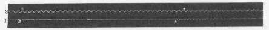
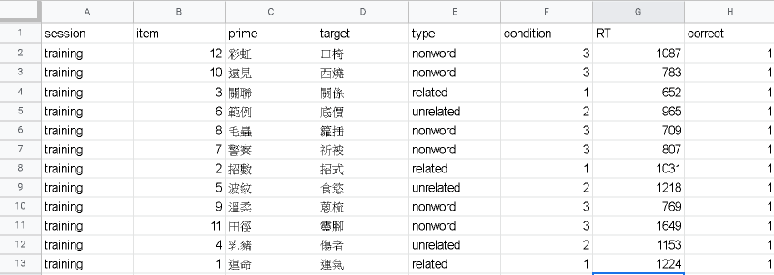
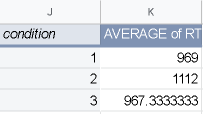
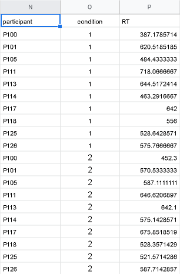

```{r setup, include=FALSE}
knitr::opts_chunk$set(echo = FALSE, 
                      warning = FALSE, 
                      message = FALSE)
```

## 單元說明
- 語言心理學的研究範圍
- 語音知覺與反應時間
- 心智詞彙網路的理論
- 詞彙判斷作業的證據
- 句子理解的理論
- 形態匹配效應的證據

## 語言心理學四大研究方向

1. 兒童如何習得語言？
2. 成人如何理解語言？
3. 成人如何產製語言？
4. 人類如何學習母語之外的語言？

更多介紹請見[教材](https://scgeeker.github.io/EXPPSY_Opensci/language.html)

## 語言心理學的重要主題

- 語音學(Phonetics)
- 構詞學(Morphology)
- 語法學(Syntax)
- 語義學(Semantics)
- 語用學(Pragmatics)

Crash Course的[語言學入門](https://www.youtube.com/playlist?list=PL8dPuuaLjXtP5mp25nStsuDzk2blncJDW)

<!---
## 記憶系統再看一眼 {.flexbox .vcenter}

```{r memory-system, echo=FALSE, fig.cap="Atkinson 與 Shiffrin(1968)提出的記憶系統模型。", message=FALSE, warning=FALSE, paged.print=TRUE}
knitr::include_graphics("http://web.mnstate.edu/malonech/images/Sensor6.jpg")
```


## 跨語言再現實驗再想想

```{r memory-rethink, echo=FALSE, fig.cap="", message=FALSE, warning=FALSE, paged.print=TRUE}
knitr::include_graphics("D:/core/Version_Controls/books/EXPPSY_slides/False_memory_students_conclusion.jpg")
```

## 假設憶的研究假設

*引述自「記憶實驗重製紀錄」*

- **設計這項實驗的研究者認為：**錯誤報告的現象顯示儲存於長期記憶的資訊，編碼有關資訊的過程中，有機會無意識地被提取出來 <- **主張不同，非再現研究**  
- **運用實驗設計：**使用學習列表全是與關鍵詞有語義相關的字詞，呈現順序依照與關鍵詞的關連強度 <- **設計不同，是概念再現**
- **以及分析方法：**通過列表關鍵詞的學習後回憶與未學習的總再認率來看是否有達到假記憶效應
- **預測結果：**參與者會錯誤辨認出學習後回憶與未學習的列表內關鍵詞的再認率高於列表內字詞學習後回憶與未學習的再認率
--->

## 語音知覺實驗範例

- [辨認發聲者的性別](https://voiceresearch.org/)(Voice Research lab by David Feinberg)

## 聲帶寬度與音高

參考[維基百科：聲帶](https://en.wikipedia.org/wiki/Vocal_cords)


## 人類的發聲器官

參考[維基百科：發聲器官](https://en.wikipedia.org/wiki/Articulatory_phonetics)

```{r VOCAL, echo=FALSE, fig.cap="", message=FALSE, warning=FALSE, out.height="50%", paged.print=TRUE}
knitr::include_graphics("https://upload.wikimedia.org/wikipedia/commons/thumb/7/75/Places_of_articulation.svg/500px-Places_of_articulation.svg.png")
```

## 人類發聲的反應時間計時

- Donders(1967~1968) 紀錄參與者A發出聲音，參與者B立刻跟隨發聲的時間差，測量「想說什麼」到「說出什麼」的反應時間



##

(跳躍一百年)


## 心智詞彙網路(Mental Lexical Network)

```{r ML69, echo=FALSE, fig.cap="", message=FALSE, warning=FALSE, out.width="80%", paged.print=TRUE}
knitr::include_graphics("https://upload.wikimedia.org/wikipedia/commons/c/cb/Hierarchical_Model_Mental_Lexicon.png")
```

@collinsRetrievalTimeSemantic1969

## 主題文獻

- 關聯性促發效應： @meyerFacilitationRecognizingPairs1971 
  [論文下載](https://osf.io/bukg3/)
- 詞頻效應與重覆效應： @forsterRepetitionPrimingFrequency1984
  [論文下載](https://osf.io/xp59g/)

## 詞彙判斷作業

- [促發程序LDT](./psytoolkit/Chinese_priming_LDT.html):測量看過相關字詞後，辨識目標字詞的反應時間，測量關聯性促發效應
- [單詞版LDT](./psytoolkit/Chinese_word_LDT.html):測量辨識字詞的反應時間，測量詞頻效應
- [重覆程序LDT](./psytoolkit/Chinese_word_RP_LDT.html):測量辨識字詞的反應時間，有兩個段落，測量重覆效應

(結束後自行複製貼上到Excel或google sheet)  
(促發程序LDT實驗分析資料示範請見下一張)

## 原始資料範例



## 個別受試者資料處理

in google sheet: `Data -> Pivot Table`  

`Rows`: condition  
`Values`: RT  
`Filters`: correct = 1  



## 多位受試者資料處理

來源： @zwaanParticipantNonnaiveteReproducibility2017




## 擴散激發(Spreading Activation)

```{r SA75, echo=FALSE, fig.cap="", message=FALSE, warning=FALSE, out.width="70%", paged.print=TRUE}
knitr::include_graphics("https://upload.wikimedia.org/wikipedia/commons/thumb/8/87/Priming_Web_Diagram.svg/500px-Priming_Web_Diagram.svg.png")
```

@collins_spreading-activation_1975-1


## 語義特徵模型(Semantic Features Model)

```{r SF74, echo=FALSE, fig.cap="", message=FALSE, warning=FALSE, out.width="70%", paged.print=TRUE}
knitr::include_graphics("https://upload.wikimedia.org/wikipedia/commons/2/2b/Semantic_Features_Model_Mental_Lexicon.png")
```

@smithStructureProcessSemantic1974


## 如何解釋關聯性促發效應

- (**主張**)相關的字詞概念在心智詞彙網路彼此連結。剛被提取的概念經由擴散激發提高有連結的項目被提取的效率，連結越強的項目越容易被提取。
- (**方法**) @meyerFacilitationRecognizingPairs1971 操作促發字詞與目標字詞的語義關聯性，測量兩種字詞組合的詞彙判斷作業反應差異。
- (**預測**) 有關聯性促發詞與目標詞嘗試反應時間，會顯著比無關聯性促發詞與目標詞嘗試反應時間短。


## 在重製中思考關聯性促發效應

- 參考[習作](https://scgeeker.github.io/EXPPSY_Opensci/language.html#lang_practice)


- @zwaanParticipantNonnaiveteReproducibility2017 進行的重覆效應來自 @meyerFacilitationRecognizingPairs1971 的那一個實驗？運用Replication Plan格式檢視兩項研究的細節。請嘗試運用 @zwaanParticipantNonnaiveteReproducibility2017 的[公開資料](./data/AllDataAssociativePriming.xlsx)，探討兩項研究測量重覆效應的條件差異？


## 詞頻效應(Word Frequency Effect)

<div class="columns-2">

- 根據語言資料庫，統計字詞出現次數，研究者可選擇做為實驗材料的字詞屬於高詞頻(High Frequency)或低詞頻(Low Frequency)。
- 可能的解釋：高詞頻字詞有較多語義表徵，相對低詞頻字詞比較容易提取。
- @forsterRepetitionPrimingFrequency1984 設計單一目標詞的詞彙判斷作業，測試重覆字詞會如何改變高詞頻及低詞頻字詞的反應速度。


```{r WF-effect, echo=FALSE, fig.cap="取自Brysbaert, Keuleers, Mandera, and Mandera (2014)", message=FALSE, warning=FALSE, out.width="75%", paged.print=TRUE}
knitr::include_graphics("https://www.researchgate.net/profile/Marc_Brysbaert/publication/287471787/figure/fig3/AS:319189849001984@1453112198178/The-word-frequency-effect-in-the-English-Lexicon-Project-lexical-decision-data-The-curve_W640.jpg")
```

</div>


## 重覆效應(Repetition Effect)

- (**主張**)高詞頻字詞短時間內被提取一次，再次提取能貢獻的反應助益，明顯小於低詞頻字詞。
- (**方法**) @forsterRepetitionPrimingFrequency1984 安排兩段詞彙判斷作業，第一段曾出現的字詞，其中一部分在第二段再次呈現。比較第一段有出現的字詞與沒有出現的字詞之反應差異。
- (**預測**) 曾在第一段出現的低詞頻字詞，在第二段的反應時間減少程度顯著大於高詞頻字詞。


## 在重製中思考重覆效應

- 參考[習作](https://scgeeker.github.io/EXPPSY_Opensci/language.html#lang_practice)

- @zwaanParticipantNonnaiveteReproducibility2017 進行的重覆效應來自 @forsterRepetitionPrimingFrequency1984 的那一個實驗？運用Replication Plan格式檢視兩項研究的細節。請嘗試運用 @zwaanParticipantNonnaiveteReproducibility2017 的[公開資料](./data/AllDataRepetitionPriming.xlsx)，探討兩項研究測量重覆效應的條件差異？

## 句子理解的兩種理論

<div class="columns-2">

```{r syntax, echo=FALSE, fig.cap="句法結構理論", message=FALSE, warning=FALSE, out.width="100%", paged.print=TRUE}
knitr::include_graphics("D:/core/Version_Controls/books/EXPPSY_slides/syntax.png")
```

```{r imagery, echo=FALSE, fig.cap="心像理論", message=FALSE, warning=FALSE, out.width="100%", paged.print=TRUE}
knitr::include_graphics("D:/core/Version_Controls/books/EXPPSY_slides/imagery.jpg")
```

</div>

## 主題文獻

- 形態匹配效應： @zwaanLanguageComprehendersMentally2002 
  [論文下載](https://osf.io/7y5fb/)


## 心像理論的假設

- (**主張**)目標圖中的物件型態，如果越符合從前導句聯想到的物件心像，讀者越容易做出快且正確的反應。
- (**方法**) @zwaanLanguageComprehendersMentally2002 安排數種句子與物件圖像，每一種都有兩組型態相符的配對，交換即成為不相符的配對。經由隨機分派，同一張圖像可獲得相符與不相符的反應資料。比較相符圖像的反應時間與不相符圖像的反應時間。
- (**預測**) 相符圖像的反應時間會顯著短於不相符圖像的反應時間。

## 句圖比對作業

[簡易示範](./psytoolkit/Chinese_Shape_Verification.html)。請了解程序之後再開始進行12項嘗試實驗。
<!---
```{r task-procedure, echo=FALSE, fig.cap="實驗程序。取自Chen et al. (in submission)", message=FALSE, warning=FALSE, out.width="70%", paged.print=TRUE}
knitr::include_graphics("D:/core/Version_Controls/books/EXPPSY_slides/fig02a.png")
```
--->

## 實驗設計 {.flexbox .vcenter} 

```{r sim-design, echo=FALSE, fig.cap="相符 vs. 不相符的句子與圖像", message=FALSE, warning=FALSE, out.width="150%", paged.print=TRUE}
knitr::include_graphics("https://scgeeker.github.io/EXPPSY_Opensci/figs/00012.jpg")
```


## 形態匹配效應

@zwaanParticipantNonnaiveteReproducibility2017 再現實驗結果

```{r 2017rep, echo=FALSE, message=FALSE, warning=FALSE, paged.print=FALSE}
require(tidyverse)

## Access the directory of data sets
csv_path <- "D:/TCU/Lecture/Experimental_Psychology/9RPs/Data Files/"

## Get the xlsx of Shape Simulation
MeansShape <- csv_path %>%
    paste0(csv_path %>% list.files(pattern="^MeansShape")) %>%
    read.csv()

## Check the mean RT by participant
(MeansShape %>% group_by(similarity) %>%
    summarise(s1_match = mean(session1_match %>% as.character() %>% as.numeric(), na.rm = TRUE),
              s1_nomatch = mean(session1_nonmatch %>% as.character() %>% as.numeric(), na.rm = TRUE),
              s2_match = mean(session2_match %>% as.character() %>% as.numeric(), na.rm = TRUE),
              s2_nomatch = mean(session2_nonmatch %>% as.character() %>% as.numeric(), na.rm = TRUE)) %>%
    gather(key = "conditions", value = "Mean", 2:5) ) %>%
right_join( MeansShape %>% group_by(similarity) %>%
  summarise(s1_match = sd(session1_match %>% as.character() %>% as.numeric(), na.rm = TRUE)/sqrt(n()),
            s1_nomatch = sd(session1_nonmatch %>% as.character() %>% as.numeric(), na.rm = TRUE)/sqrt(n()),
            s2_match = sd(session2_match %>% as.character() %>% as.numeric(), na.rm = TRUE)/sqrt(n()),
            s2_nomatch = sd(session2_nonmatch %>% as.character() %>% as.numeric(), na.rm = TRUE)/sqrt(n())) %>%
  gather(key = "conditions", value = "SE", 2:5), by=c("similarity","conditions"), copy = TRUE ) %>%
  separate(conditions, c("session","matching"), sep = "_") %>%
  arrange(desc(similarity)) %>%
ggplot(aes(x=matching, y = Mean, color = matching))  + 
  geom_bar(stat = "identity", fill = "white") +
  geom_errorbar(aes(ymin=Mean-SE, ymax=Mean+SE), width=.2,
                position=position_dodge(.9)) +
  facet_grid(vars(similarity), vars(session)) +
  coord_cartesian(ylim = c(600, 1000)) 

```

## 在重製中思考形態模擬效應

- 參考[習作](https://scgeeker.github.io/EXPPSY_Opensci/language.html#lang_practice)

- @zwaanParticipantNonnaiveteReproducibility2017 進行的重覆效應來自 @zwaanLanguageComprehendersMentally2002  的那一個實驗？請運用Replication Plan格式檢視兩項研究的細節。請嘗試運用 @zwaanParticipantNonnaiveteReproducibility2017 的[公開資料](./data/AllDataShapeSimulation.xlsx)，探討兩項研究測量重覆效應的條件差異？


## 參考文獻